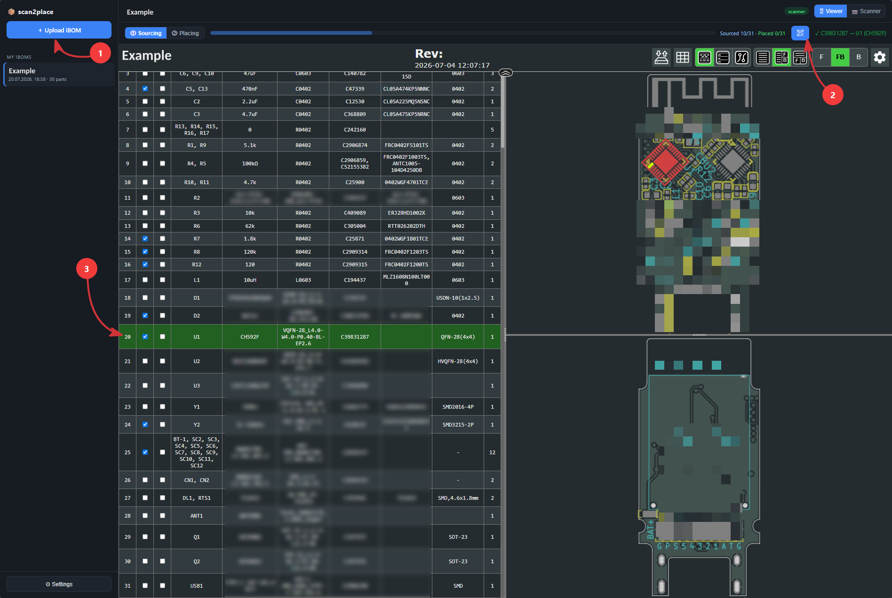
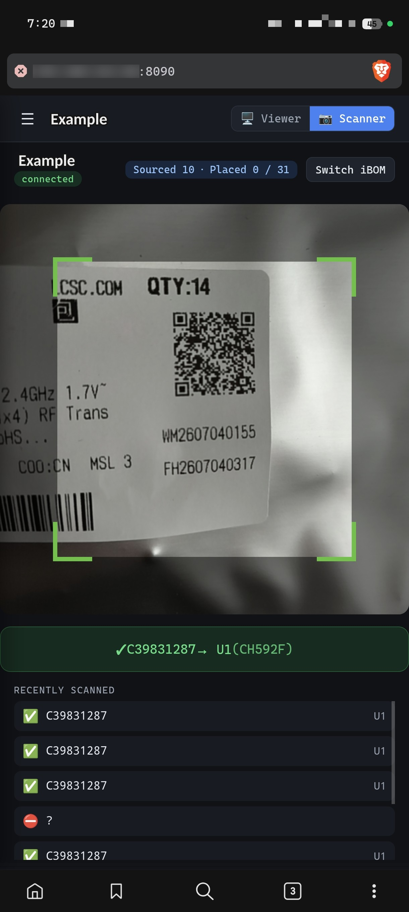
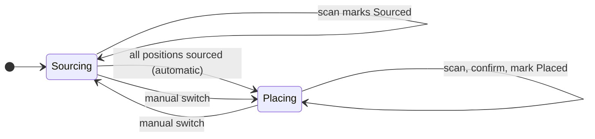
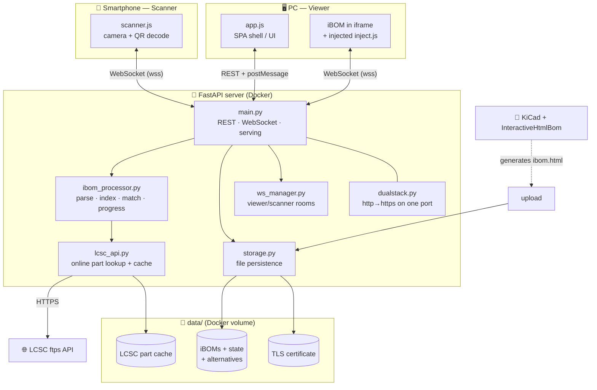

# 📦 scan2place

**Scan the QR code on your LCSC/JLCPCB part packaging with your phone — the matching
component lights up in your interactive BOM on the PC and gets checked off. Instantly.**

No searching. No comparing part numbers by hand. Just scan, source, place — done.

---

## Why this exists

I design my boards in KiCad and use my own LCSC parts importer to pull the component
symbols and footprints straight into the schematic — that part is fast.

The slow part comes later. When the first prototype arrives — the one you still
hand-assemble, whether for the fun of it or simply because it's the economical choice
for a single board — it turns up as a box full of little plastic bags, each with a
sticker carrying an LCSC part number. Matching every bag to its position on the board
by hand, while keeping track of what you already have and what is still missing, is
tedious and easy to get wrong.

**scan2place** turns that into a single motion. Point your phone at the sticker on a
bag and the matching component lights up in the interactive BOM on your PC and gets
checked off — so at any moment you see at a glance what is sourced, what is placed, and
what is still missing. Fast, and hard to get wrong.

It builds on KiCad's excellent
[InteractiveHtmlBom](https://github.com/openscopeproject/InteractiveHtmlBom), which
generates the interactive BOM this tool drives.

---

## What it does

* **PC (Viewer):** shows the real KiCad *InteractiveHtmlBom*. Scanned parts are
  highlighted, scrolled into view and ticked off.
* **Phone (Scanner):** scans the QR/DataMatrix labels on the part packaging and sends
  them live to the Viewer over your LAN.
* Works with **any** iBOM from InteractiveHtmlBom — the LCSC part field is detected
  automatically (by name *or* value pattern).
* Multiple iBOMs, progress **stored on the server** per BOM — pick up where you left off.

> 📖 A longer, illustrated write-up with additional data-flow diagrams lives in
> [`docs/README.md`](docs/README.md).

---

## What it looks like

<p align="center">
  <br>
  <sub><b>PC — the Viewer.</b> ① open or upload an iBOM &nbsp;·&nbsp; ② show the pairing QR for the phone &nbsp;·&nbsp; ③ the scanned part <code>U1</code> is preselected, highlighted on the board and ticked off — with live <code>Sourced&nbsp;10/31 · Placed&nbsp;0/31</code> progress along the top.</sub>
</p>

<br>

<p align="center">
  <br>
  <sub><b>Phone — the Scanner.</b> point the camera at an LCSC sticker; the match is confirmed instantly (<code>✓ C39831287 → U1</code>), with live progress and a running history of recent scans.</sub>
</p>

---

## Workflow

One motion per part: scan the bag, watch it light up on the board. That's the whole loop.


The sourcing → placing pipeline drives the two phases and advances automatically:



---

## Getting started (self-hosting)

The container image is published to the GitHub Container Registry, so a minimal
`docker-compose.yml` is all you need — no build step:

```yaml
services:
  scan2place:
    image: ghcr.io/theautomatist/scan2place:latest
    ports:
      - "8090:8090"
    volumes:
      - ./data:/app/data      # persistent: iBOMs, progress, LCSC cache, TLS cert
    environment:
      - USE_HTTPS=1           # self-signed TLS — required for the phone camera
    restart: unless-stopped
```

```bash
docker compose up -d
```

The app is now reachable on your LAN at **`https://<PC-IP>:8090`** (find the IP with
`ipconfig` / `ip addr`). You can type the bare address — `http://` is redirected to
`https://` automatically.

> **HTTPS / certificate:** on first start the server generates a self-signed certificate
> under `data/certs/`. This is **required so the phone's browser grants camera access**
> (browsers only allow the camera over HTTPS). Accept the one-time browser warning
> (*Advanced → Continue*). The server serves both `http://` (→ redirect) and `https://`
> on the **same** port (8090).

### Behind a reverse proxy

Running behind Traefik / Caddy / nginx-proxy-manager that already terminates TLS? Set
`USE_HTTPS=0` so the app speaks plain HTTP and lets the proxy handle certificates. The
proxy **must** serve `https://`, otherwise the phone gets no camera access.

### Build from source instead

```bash
git clone https://github.com/theautomatist/scan2place.git
cd scan2place
docker compose up -d --build
```

The bundled [`docker-compose.yml`](docker-compose.yml) carries both `image:` and
`build:`, so `--build` compiles locally while a plain `up -d` pulls the published image.
Change the host port in `ports:` if `8090` is taken.

---

## Preparing the iBOM

scan2place reads a standard iBOM from
[InteractiveHtmlBom](https://github.com/openscopeproject/InteractiveHtmlBom) — it never
modifies your `ibom.html`, it only needs a few columns to be present.

**Required — the LCSC part number.** The only hard requirement. It is found either way:

- **By column name** — any custom field whose name contains **`LCSC`**
  (case-insensitive): `LCSC Part #`, `LCSC Part Number` or plain `LCSC` all work — the
  `#` is irrelevant.
- **By value pattern** — otherwise scan2place auto-detects the column whose values look
  like LCSC codes (`C` followed by 3 or more digits, e.g. `C2906290`), so a
  differently-named column still works.

Add the field to your parts in KiCad and make sure InteractiveHtmlBom includes it
(`--extra-fields "LCSC Part #"`, or the plugin's *Extra fields* box). Without it, upload
still works but nothing can be matched (the sidebar shows a ⚠).

**For progress & the pipeline — the `Sourced` / `Placed` checkboxes.** These are
InteractiveHtmlBom's defaults (`--checkboxes "Sourced,Placed"`); keep them so the
progress bar and the sourcing → placing flow work.

**For alternative matching (resistors, capacitors, inductors) — `Value` + `Footprint`.**
To offer an equivalent BOM part for a scanned-but-unlisted LCSC number, scan2place reads:

- a **`Value`** column with a parseable value — `470nF`, `4.7k`, `10uH`, RKM notation
  like `4k7`, `100kΩ` … (KiCad's standard *Value* field);
- a **`Footprint`** or **`Package`** column — the part type comes from the leading letter
  (`C`0402 → capacitor, `R` → resistor, `L` → inductor) and the size (`0402`, `0603`, …)
  is used as a preferred-match bonus.

Exact scans — the everyday case — only need the LCSC field. Alternative matching is
limited to R/L/C; ICs, connectors, etc. are matched by LCSC number only.

**Optional — `Mfr. Part #` / `MPN`.** Any field containing `mfr`, `manufacturer` or
`mpn` is shown for reference only.

---

## How you use it

1. **On the PC**, open `https://<PC-IP>:8090`, **upload** your `ibom.html` from the
   sidebar → it opens as the **Viewer**.
2. Click **Connect scanner** (top right) → a **QR code** appears.
3. **Scan that QR** with your **phone** → the Scanner opens for exactly this BOM.
4. Scan the part packaging → the component is highlighted and ticked off in the Viewer;
   the phone shows a green confirmation with reference(s) and value.

### The sourcing → placing pipeline

scan2place guides you through two phases, tracked per BOM on the server:

1. **① Sourcing** — every scan marks that position as **Sourced**. Once *all* positions
   are sourced, the phase advances to *Placing* automatically.
2. **② Placing** — a scan asks the phone *"all N parts placed?"*; after you confirm, the
   position is marked **Placed**.

The Viewer shows a phase switcher (also switchable by hand) and a dual progress bar
(`Sourced 12/30 · Placed 5/30`). Placed rows are tinted a subtle green.

### QR-code format

JLCPCB/LCSC packaging labels carry a QR code like:

```
{pbn:PICK2607040232,on:WM2607040155,pc:C2906290,pm:TYPE-C 16P CB1.6 073,qty:15,...}
```

The **`pc`** field is the LCSC part number (`C2906290`) that gets matched against the
BOM. Bare LCSC numbers (`C2906290`) are recognised too. A single QR that maps to several
components (e.g. 5× the same capacitor) highlights and ticks off the whole group.

---

## Alternative parts

Sometimes a **functionally-equivalent part with a different LCSC number** is fitted
(e.g. a 470nF/0402 from another manufacturer). The scanner handles it:

1. If the scanned LCSC number is **not** in the BOM, it is **looked up online at LCSC**
   (value, package, part type) — results are cached in `data/lcsc_cache/`.
2. If a BOM part matches by **type + value + package**, the camera **pauses** and shows
   two large one-handed buttons: **[✓ Adopt]** and **[✗ Reject]**. The camera resumes
   only after you decide.
3. On *Adopt*, the original BOM row is **greyed out** and a **cloned row with the
   alternative's real data** (fetched from the LCSC API) is inserted right below it.
   Hovering that alt row highlights its footprints on the PCB. It can be removed again
   via the small ✕ on the right. The position counts as *Sourced*.
4. If nothing matches, the phone reports *"not part of this project"*.

Highlighting of alt rows (on/off + colour) is configurable under **⚙ Settings**
(default: light blue). The online lookup needs an internet connection.

---

## Settings

Under **⚙ Settings** (bottom left):

| Setting | Effect |
|---|---|
| **Scroll to component** | Viewer jumps to the scanned BOM row |
| **Highlight alternatives** + colour | Tint rows that have an adopted alternative |
| **Highlight placed rows** | Subtle green tint on placed rows |
| **Sound** / **Vibrate** | Feedback on the phone on a successful scan |

Progress (which positions are *Sourced* / *Placed*) is stored per iBOM and survives
restarts — reopen the same BOM to continue another day.

---

## Local development (without Docker)

```bash
pip install -r requirements.txt

# With HTTPS (default, for the phone camera):
python -m app.main

# Without HTTPS (e.g. PC-only / testing):
USE_HTTPS=0 python -m app.main      # PowerShell:  $env:USE_HTTPS=0; python -m app.main
```

Environment variables: `PORT` (default `8090`), `HOST` (default `0.0.0.0`),
`USE_HTTPS` (`1`/`0`).

### End-to-end smoke test (no browser extension)

Verifies headlessly with a real browser (Edge/Chrome) that a simulated scan actually
highlights and ticks off the component in the iBOM:

```bash
pip install playwright websockets

# Terminal 1 — start the server:
USE_HTTPS=0 PORT=8077 python -m app.main

# Terminal 2 — run the test:
python tests/browser_smoke.py --url http://127.0.0.1:8077 \
    --ibom "path/to/your/ibom.html"
```

Pick the browser channel with `--channel msedge|chrome|chromium` (default `msedge`).

---

## How it works

A single FastAPI server serves the (unmodified) iBOM inside an `<iframe>` and injects a
small sync script into it. A WebSocket "room" per iBOM connects the phone (scanner) and
the PC (viewer).



* The server reads the iBOM (`pcbdata` is LZString-compressed), detects the LCSC field
  and builds an index **LCSC number → references / footprints**.
* When serving the iBOM (inside the Viewer's `<iframe>`), a small **sync script**
  (`static/inject.js`) is injected. It drives the BOM's own functions
  (`checkBomCheckbox`, `footprintIndexToHandler`, `readStorage`/`writeStorage`,
  `EventHandler`) to highlight rows, tick checkboxes and report changes to the server.
* A **WebSocket** connects Scanner (phone) and Viewer (PC) in the same "room" (= iBOM).
* The original `ibom.html` is never modified — all state lives separately under `data/`.

---

## Project structure

```
app/
  main.py            FastAPI: routes, iBOM serving, WebSocket, HTTPS start
  ibom_processor.py  parse pcbdata, detect LCSC field, index, alternatives, progress, inject
  lcsc_api.py        online LCSC part lookup (+ disk cache)
  values.py          value / package normalisation for matching
  qr.py              LCSC/JLCPCB QR payload parser
  storage.py         file-based persistence (iBOMs, state, alternatives, settings)
  ws_manager.py      WebSocket rooms (viewer / scanner)
  dualstack.py       single-port http→https multiplexer
  certs.py           self-signed TLS certificate
static/
  app.js  scanner.js  inject.js  style.css
  vendor/            html5-qrcode (scanner) · qrcode-generator (pairing QR)
templates/index.html
tests/               headless end-to-end smoke tests (Playwright, no extension needed)
data/                (runtime) uploaded iBOMs, state, cache, certificate
.github/workflows/   CI: build & publish the Docker image to ghcr.io
```

---

## Troubleshooting

* **Camera won't start on the phone** → the page must be opened over **HTTPS**
  (`https://…`) and camera access granted. Accept the certificate warning once.
* **"no viewer open"** on the scanner → the same iBOM must be open in the Viewer on the PC.
* **Part not found** → check the iBOM actually has an LCSC field (the ⚠ in the list warns
  otherwise) and that the scanned `pc` number matches it.
* **Port 8090 in use** → change it in `docker-compose.yml` (`ports:` **and** `PORT=`).
* **`docker compose up -d` can't pull the image** → the package may be private; either
  make it public in the repo's *Packages* settings, or `docker login ghcr.io` first.
