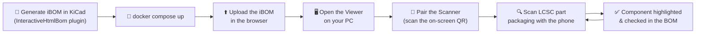
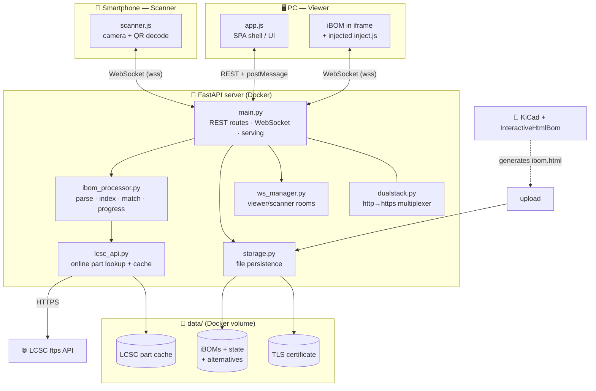
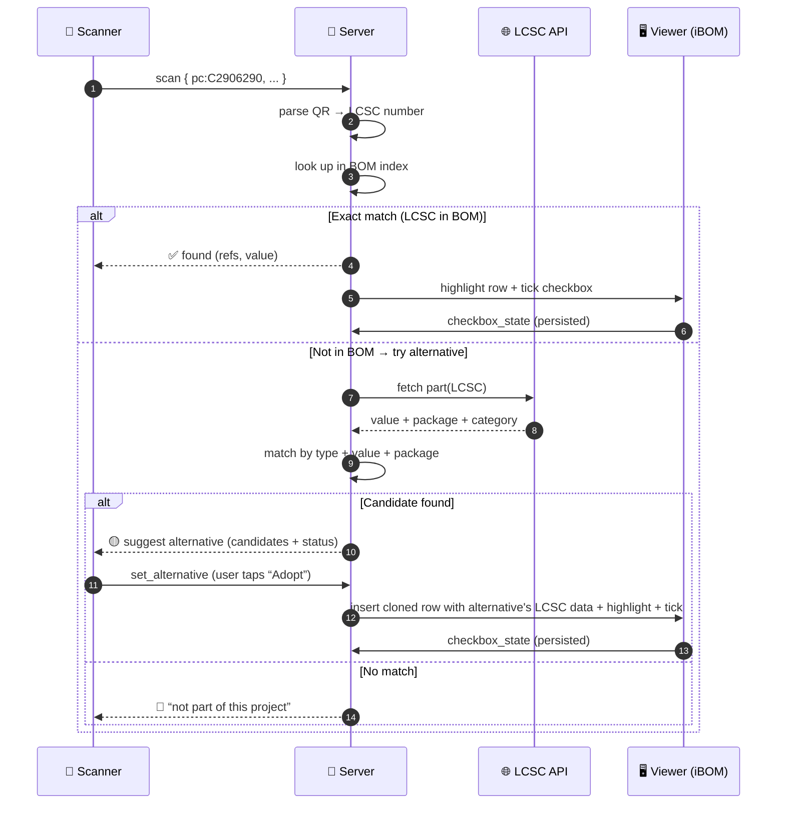
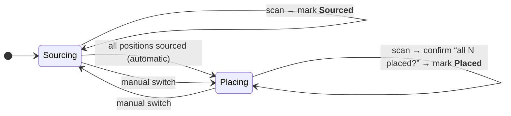

# 📦 scan2place

**Scan the QR code on your LCSC/JLCPCB part packaging with your phone — the matching
component lights up in your interactive BOM and gets checked off. Instantly.**

No searching. No comparing part numbers by hand. No spreadsheets. Just fast, effective
sourcing and placement while you build your board.

---

## The idea

Building a PCB means handling dozens of tiny reels and bags, each labelled with an
LCSC part number. Figuring out *which* bag belongs to *which* position on the board — and
keeping track of what you already have and what you already soldered — is slow and
error-prone.

This tool turns that into a one-motion workflow:



The PC shows the real interactive BOM. The phone is a barcode scanner. They talk to each
other live over your LAN through a tiny self-hosted server. That's it.

- **Source parts:** scan every bag as it arrives → each position is marked *Sourced*.
- **Place parts:** scan again while soldering → confirm → each position is marked *Placed*.
- **Alternatives handled automatically:** scanned a functionally-equivalent part with a
  different LCSC number? The tool looks it up online, matches it by value + package, and
  offers to adopt it as an alternative.

Works with **any** iBOM produced by
[openscopeproject/InteractiveHtmlBom](https://github.com/openscopeproject/InteractiveHtmlBom) —
the LCSC part field is detected automatically.

---

## Quick start

### 1. Generate an iBOM in KiCad

Install the [InteractiveHtmlBom](https://github.com/openscopeproject/InteractiveHtmlBom)
plugin and run it on your board. Make sure your components carry an **LCSC part number**
field (e.g. `LCSC Part #`). You get a single self-contained `ibom.html`.

### 2. Start the stack

```bash
docker compose up -d --build
```

The app is now reachable on your LAN at **`<PC-IP>:8090`** (find the IP with `ipconfig`
/ `ip addr`). You can type the bare address — `http://` is redirected to `https://`
automatically. HTTPS uses a self-signed certificate (generated on first start); accept the
one-time warning. HTTPS is required so the phone's browser grants camera access.

### 3. Use it

1. On the **PC**, open the address, upload your `ibom.html` from the sidebar, and open it
   as **Viewer**.
2. Click **Connect scanner** — a QR code appears.
3. Scan that QR with your **phone** — the Scanner opens for exactly this BOM.
4. Scan the QR/DataMatrix labels on your part packaging. Done.

> The QR codes on LCSC/JLCPCB packaging look like
> `{pbn:...,pc:C2906290,pm:TYPE-C 16P CB1.6 073,qty:15,...}` — the `pc:` field is the LCSC
> part number that gets matched against the BOM.

---

## How it works

A single FastAPI server serves the (unmodified) iBOM inside an `<iframe>` and injects a
small sync script into it. That script drives the BOM's own functions to highlight rows
and tick checkboxes, and syncs state back to the server. A WebSocket "room" per iBOM
connects the phone (scanner) and the PC (viewer).



### Component reference

| Component | Responsibility |
|---|---|
| `app/main.py` | FastAPI routes, iBOM serving with script injection, WebSocket bridge, HTTPS start |
| `app/ibom_processor.py` | Decompress `pcbdata` (LZString), detect the LCSC field, build the LCSC→refs index, list positions, match alternatives, compute progress, inject the sync script |
| `app/lcsc_api.py` | Look up value/package for an LCSC number via the LCSC `ftps` API; cache results on disk |
| `app/values.py` | Normalise values/packages (`470nF`→Farad, `C0402`→`0402`) for matching |
| `app/qr.py` | Parse the LCSC/JLCPCB packaging QR payload |
| `app/storage.py` | File-based persistence: iBOMs, checkbox state, alternatives, phase, settings |
| `app/ws_manager.py` | WebSocket rooms — viewer(s) + scanner(s) per iBOM |
| `app/dualstack.py` | Protocol multiplexer so `http://` and `https://` share one port |
| `app/certs.py` | Generate the self-signed TLS certificate |
| `static/app.js` | SPA shell: sidebar/history, upload, roles, viewer embed, pairing QR, settings, pipeline UI |
| `static/scanner.js` | Camera QR scanner (html5-qrcode) + scanner WebSocket |
| `static/inject.js` | Injected into the iBOM: highlight, check, alternative rows, row colouring, state sync |
| `templates/index.html` | Single-page app shell |

---

## Data flow: a single scan

The server classifies every scan into one of three outcomes. Exact hits are checked off
immediately; unknown parts are looked up online and offered as alternatives; everything
else is reported as not belonging to the project.



Results are cached, so re-scanning the same part is instant. All state lives in
`data/` and survives restarts.

---

## Sourcing → Placing pipeline

scan2place guides you through a two-phase flow. The server tracks the phase per iBOM and
advances it automatically once every position is sourced.



The Viewer shows the current phase (also switchable by hand) and a dual progress bar
(`Sourced 12/30 · Placed 5/30`). Placed rows are tinted a subtle green; rows with an
adopted alternative are tinted blue.

---

## Project structure

```
app/
  main.py            FastAPI: routes, iBOM serving, WebSocket, HTTPS start
  ibom_processor.py  parse pcbdata, detect LCSC field, index, alternatives, progress, inject
  lcsc_api.py        online LCSC part lookup (+ disk cache)
  values.py          value / package normalisation
  qr.py              LCSC/JLCPCB QR payload parser
  storage.py         file-based persistence (iBOMs, state, alternatives, settings)
  ws_manager.py      WebSocket rooms (viewer / scanner)
  dualstack.py       single-port http→https multiplexer
  certs.py           self-signed TLS certificate
static/
  app.js  scanner.js  inject.js  style.css
  vendor/            html5-qrcode (scanner) · qrcode-generator (pairing QR)
templates/index.html
tests/               headless end-to-end smoke tests (Playwright, no extension needed)
data/                (runtime) uploaded iBOMs, state, cache, certificate
```

---

## Technical notes

- **Non-destructive:** the original `ibom.html` is never modified. The sync script is
  injected only when serving, and all progress is stored separately under `data/`.
- **LCSC field auto-detection:** by field name (contains “LCSC”) or, as a fallback, by
  detecting the column whose values match the `C#####` pattern — so arbitrary iBOMs work.
- **HTTPS on one port:** `dualstack.py` peeks the first byte of each connection and either
  proxies TLS to the internal server or answers plain HTTP with a redirect to `https://`.
- **Camera requires a secure context:** that's why the server runs HTTPS even on the LAN.

---

*Built to make hand-assembly of LCSC/JLCPCB boards fast: scan, source, place — done.*
